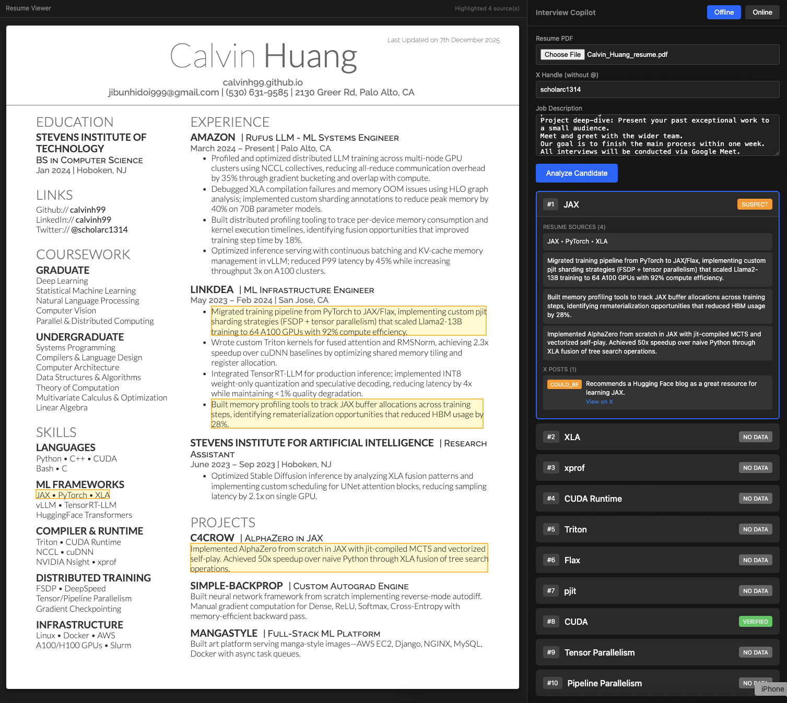
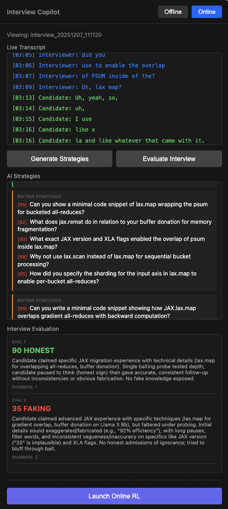
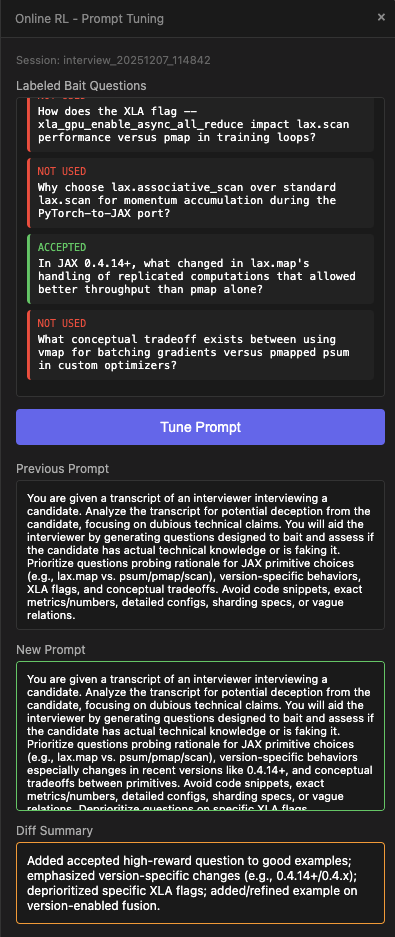

# Interview Copilot

AI-powered interview assistant built for the **xAI Grok Hackathon**. Uses Grok's advanced reasoning and real-time capabilities to help interviewers detect deception and validate candidate claims.

## Features

### Offline Mode: Pre-Interview Analysis
Analyze candidates before the interview by comparing their resume claims against their X (Twitter) activity.

- **Resume Skill Extraction**: Grok analyzes uploaded PDF resumes to extract claimed skills with exact quotes
- **X Profile Search**: Grok searches the candidate's X posts for evidence of each skill using the `x_search` tool
- **Inconsistency Flagging**: Cross-references resume claims with social media evidence to flag suspicious discrepancies



### Online Mode: Live Interview Assistant
Real-time transcript analysis during interviews with AI-generated strategies.

- **Dual Audio Transcription**: Captures both interviewer and candidate audio using xAI's streaming speech-to-text
- **Baiting Strategies**: Grok generates trick questions designed to expose candidates faking technical knowledge
- **Technical Hints**: Deep follow-up questions to probe actual understanding
- **Live Evaluation**: Real-time honesty scoring and deception detection



### Online RL: Prompt Tuning
Self-improving system that learns from interview outcomes.

- **Question Tracking**: Tracks which AI-generated questions the interviewer actually used using Grok
- **Prompt Evolution**: Automatically tunes the baiting prompt based on reward signal (accepted/rejected questions)



## Grok Integration

This project leverages multiple Grok capabilities:

| Feature | Grok Capability |
|---------|-----------------|
| Resume analysis | Files API + multimodal reasoning |
| X profile search | `x_search` tool with handle filtering |
| Baiting question generation | Fast reasoning (grok-4-1-fast) |
| Interview evaluation | Deep reasoning for deception detection |
| Speech-to-text | xAI streaming WebSocket STT |
| Prompt tuning | Reasoning model for prompt optimization |

## Prerequisites

Install [uv](https://docs.astral.sh/uv/) (Python package manager):
```bash
curl -LsSf https://astral.sh/uv/install.sh | sh
```

Install [bun](https://bun.sh/) (JS runtime):
```bash
curl -fsSL https://bun.sh/install | bash
```

## Setup

```bash
# Backend
cd backend
uv sync

# Frontend
cd ../frontend
bun install
```

Set your xAI API key:
```bash
export XAI_API_KEY=your_key_here
```

## Run

Terminal 1 (backend):
```bash
cd backend
uv run uvicorn src.app:app --reload --port 8000
```

Terminal 2 (frontend):
```bash
cd frontend
bun start
```

Or run both:
```bash
./start.sh
```

## Structure

```
backend/          Python FastAPI
  src/
    app.py        API endpoints
    offline/      Pre-interview analysis
    online/       Live transcript processing
    prompt/       Prompt versioning & tuning
    reward/       Question tracking for RL
    common/       Shared utils (Grok API)

frontend/         Electron floating window
  src/
    index.js      Main process
    index.html    UI
    renderer.js   API calls
```
